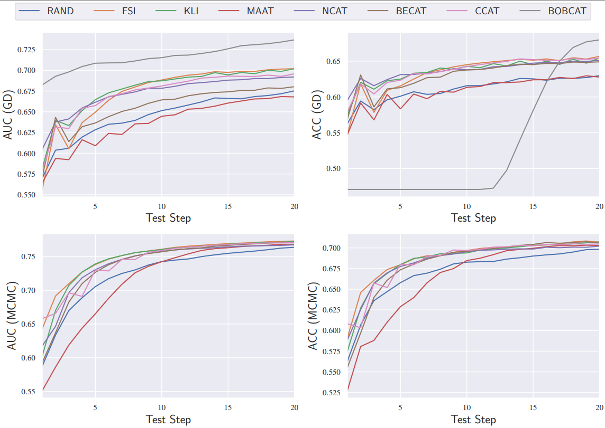

SAU KHI LÀM HẾT CÁC BƯỚC PHÍA DƯỚI, CHẠY APP.PY LÀ ĐƯỢC

ĐƯỜNG DẪN BỘ DATASETS
https://eedi.com/projects/neurips-education-challenge

## Requirements

To install requirements:

```setup
pip install -r requirements.txt
```

## Data Preprocessing

**！！！The preprocessing data is provided in Supplementary_material, which means you can skip this step.**


Deconstruct the downloaded data as follows:

```train
data/
│
├── NIPS2020/
│   ├── train_task_3_4.csv
│   └── meta_data.csv
│
│
└── dataset.py
│
└── mcmc.py
│
└── prepare_data.py
│
└── setting.py
```

To preprocessing the dataset,run:

```train
cd data
python prepare_data.py --data_name='NIPS2020'

```

>📋  **prepare_data.py** will delete students with less than 50 answering records, as well as delete questions with less than 50 answering times. The dataset will be divided into a training set (collaborative students) and a testing set (tested students) in a 4:1 ratio. The outputs of prepare_data.py are **train_triples.csv**, **test_triples.csv**, **triples.csv**, **metadata.json**, **concept_map.json**.

| Dataset                     | NIPS-EDU(NIPS2020) | JUNYI    |
| --------------------------- | ------------------ | -------- |
| \#Students                  | 4,914              | 8,852    |
| \#Questions                 | 900                | 702      |
| \#Response logs             | 1,382,173          | 801,270  |
| \#Response logs per student | 281.27             | 90.52    |
| #Response logs per question | 1,535.75           | 1,141.41 |

 To get the parameter of <font size=4>[IRT](https://link.springer.com/book/10.1007/978-0-387-89976-3):</font> estimated by mcmc method, run:

```train
python mcmc.py --data_name='NIPS2020'
```

>📋  **mcmc.py** will use Monte Carlo sampling on the dataset to perform posterior estimation on the IRT model, in order to obtain the parameters of the IRT model. The outputs are **alpha.npy** and **beta.npy**, which contains the discrimination and difficulty of questions.

After the data preprocess, the fold becomes(which is provided):

```train
data/
│
├── NIPS2020/
│   ├── alpha.npy
│   ├── beta.npy
│   ├── concept_map.json
│   ├── metadata.json
│   ├── test_triples.csv
│   ├── train_triples.csv
│   └── triples.csv
│
```

To preprocessing the dataset,run:

## Evaluation

To evaluate my model, run:

```train
python main.py --method='ccat' --irt_method='mcmc' --data_name='NIPS2020' --seed=2024 --device='cuda'
```

>📋  main.py contains code for selecting questions and evaluating **ranking consistency**. 
>
>This includes the following hyperparameters:
>
>**method** can choose the selection strategy of CAT, including random, **fsi**, **kli**, **maat**, **ncat**, **becat**, **ccat**. 
>
>**irt_method** controls the training method of the irt model, including **mcmc** and **gd**. 
>
>**data_name** is the dataset used in the experiment, including **NIPS2020** and **JUNYI**. 
>
>**seed** controls the initialization parameters of student abilities, and the seed used in the article is **2023**, **2024**, **2025**, **2026**, **2027**.

## Results

Our model achieves the following performance on :

### Intra Ranking Consistency(MCMC)

| NIPS2020                                                     | Step 5            | Step 10           | Step 15           | Step 20           |
| ------------------------------------------------------------ | ----------------- | ----------------- | ----------------- | ----------------- |
| Random                                                       | 0.7411/0.7531     | 0.8061/0.8084     | 0.8348/0.8363     | 0.8540/0.8547     |
| [<u>FSI</u>](https://api.taylorfrancis.com/content/books/mono/download?identifierName=doi&identifierValue=10.4324/9780203056615&type=googlepdf) | 0.7912/0.7933     | 0.8570/0.8573     | 0.8846/0.8848     | 0.8975/**0.8977** |
| [<u>KLI</u>](https://journals.sagepub.com/doi/abs/10.1177/014662169602000303) | 0.7821/0.7839     | 0.8532/0.8530     | 0.8804/0.8805     | 0.8965/0.8966     |
| [<u>MAAT</u>](https://ieeexplore.ieee.org/abstract/document/9338437/) | 0.6762/0.6909     | 0.8083/0.8090     | 0.8588/0.8595     | 0.8843/0.8848     |
| [<u>NCAT</u>](https://ojs.aaai.org/index.php/AAAI/article/view/20399) | 0.7766/0.7923     | 0.8451/0.8501     | 0.8710/0.8725     | 0.8831/0.8840     |
| [<u>BECAT</u>](https://nips.cc/virtual/2023/poster/70224)    | 0.7685/0.7680     | 0.8441/0.8449     | 0.8766/0.8771     | 0.8958/0.8961     |
| CCAT                                                         | 0.7982/**0.8149** | 0.8561/**0.8635** | 0.8832/**0.8851** | 0.8955/0.8969     |

>📋  The results in each grid are evaluated using IRT on the left and CCAT on the right, respectively.

### Inter Ranking Consistency

| NIPS2020                                                     | Step 5     | Step 10    | Step 15    | Step 20    |
| ------------------------------------------------------------ | ---------- | ---------- | ---------- | ---------- |
| Random                                                       | 0.7798     | 0.8325     | 0.8590     | 0.8760     |
| [<u>FSI</u>](https://api.taylorfrancis.com/content/books/mono/download?identifierName=doi&identifierValue=10.4324/9780203056615&type=googlepdf) | 0.8258     | 0.8785     | 0.9013     | **0.9126** |
| [<u>KLI</u>](https://journals.sagepub.com/doi/abs/10.1177/014662169602000303) | 0.8195     | 0.8758     | 0.8985     | 0.9119     |
| [<u>MAAT</u>](https://ieeexplore.ieee.org/abstract/document/9338437/) | 0.7242     | 0.8373     | 0.8807     | 0.9023     |
| [<u>NCAT</u>](https://ojs.aaai.org/index.php/AAAI/article/view/20399) | 0.8286     | 0.8697     | 0.8892     | 0.8994     |
| [<u>BECAT</u>](https://nips.cc/virtual/2023/poster/70224)    | 0.8045     | 0.8676     | 0.8948     | 0.9104     |
| CCAT                                                         | **0.8476** | **0.8839** | **0.9013** | 0.9116     |

### ACC/AUC




## Contributing

>📋  We use the MIT License.
